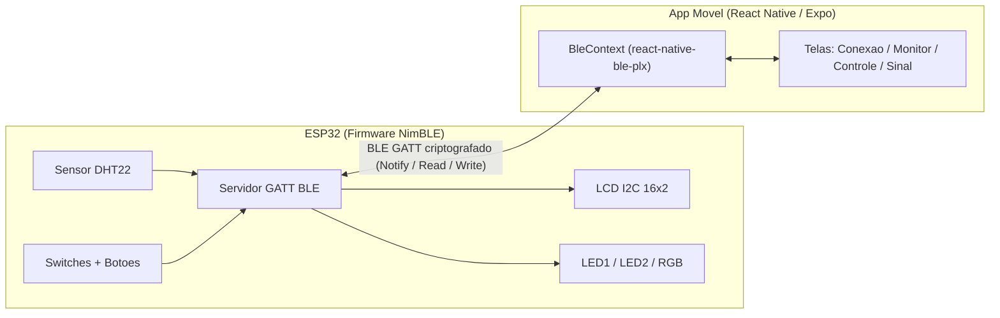
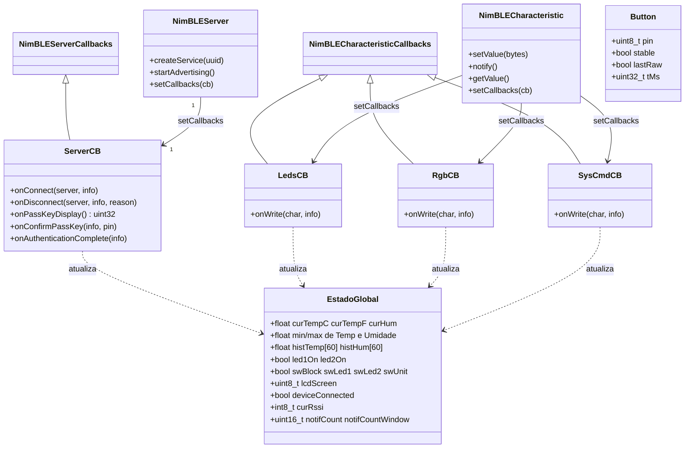
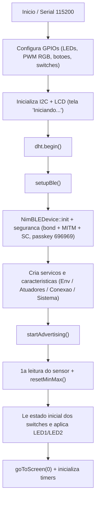
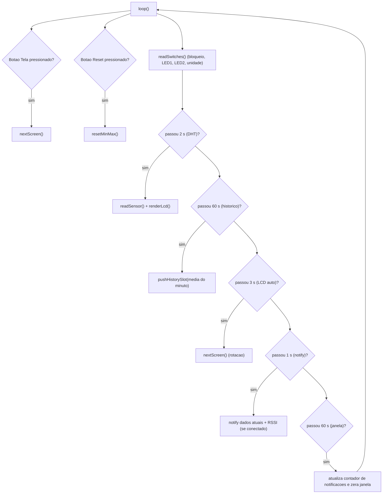
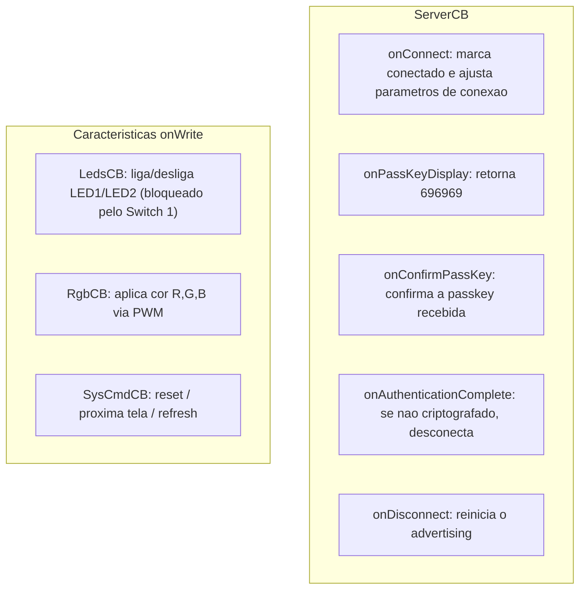
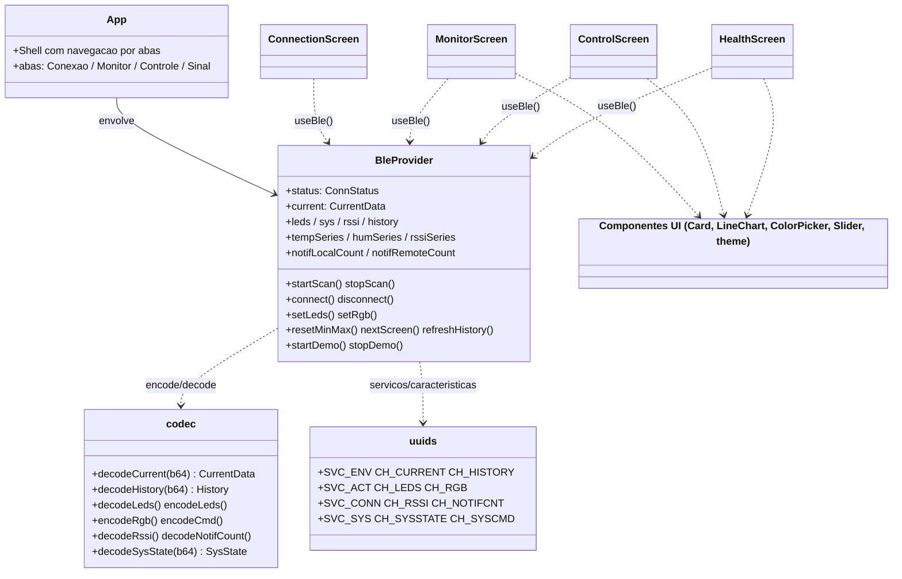

# ESP32 Temp Monitor

Sistema de monitoramento ambiental com **ESP32 + DHT22** exposto via **Bluetooth Low Energy (BLE/GATT)**, acompanhado de um aplicativo móvel **React Native (Expo)** que conecta, parea, lê dados em tempo real, controla LEDs (simples e RGB) e exibe gráficos de temperatura, umidade e qualidade de sinal.

| Item | Detalhe |
| --- | --- |
| Firmware | [`ESP-32/esp32_temp_monitor.ino`](ESP-32/esp32_temp_monitor.ino) (Arduino + NimBLE-Arduino) |
| Aplicativo | [`MOBILE/`](MOBILE/) (Expo 54, React Native 0.81, `react-native-ble-plx`) |
| Nome BLE | `ESP32_TEMP_MONITOR` |
| Passkey de pareamento | `696969` |
| Segurança | Bonding + MITM + Secure Connections; todas as características exigem conexão criptografada |

> Toda a comunicação GATT é criptografada. Na primeira conexão o Android solicita a senha de pareamento `696969`. O app `react-native-ble-plx` exige um build nativo (Dev Client / APK); não roda no Expo Go — para visualizar as telas sem hardware, use o **Modo de teste** embutido.

---

## Índice

1. [Funcionalidades](#1-funcionalidades)
2. [Estrutura do repositório](#2-estrutura-do-repositório)
3. [Hardware e pinagem](#3-hardware-e-pinagem)
4. [Visão geral da arquitetura](#4-visão-geral-da-arquitetura)
5. [Firmware — Diagrama de classes](#5-firmware--diagrama-de-classes)
6. [Firmware — Fluxograma (setup, loop e callbacks)](#6-firmware--fluxograma-setup-loop-e-callbacks)
7. [Arquitetura do Perfil GATT (tabela de UUIDs)](#7-arquitetura-do-perfil-gatt-tabela-de-uuids)
8. [Formato dos dados (codec)](#8-formato-dos-dados-codec)
9. [App — Diagrama de classes e principais funções](#9-app--diagrama-de-classes-e-principais-funções)
10. [Compilação e instalação do App](#10-compilação-e-instalação-do-app)
11. [Compilação e gravação do Firmware](#11-compilação-e-gravação-do-firmware)
12. [Uso](#12-uso)
13. [Solução de problemas](#13-solução-de-problemas)

---

## 1. Funcionalidades

- Leitura de **temperatura (°C e °F)** e **umidade** do DHT22, com notificação BLE a cada 1 s.
- **Histórico** das médias por minuto dos últimos 60 minutos, baixado sob demanda para gráfico.
- Registro contínuo de **mínimos e máximos** de temperatura e umidade, com comando de reset.
- Controle remoto de **dois LEDs simples** (com confirmação GATT) e de um **LED RGB** via Color Picker (Write Without Response para transição fluida).
- **Switch físico de bloqueio**: quando ativo, ignora a escrita remota nos LEDs simples.
- Indicadores de conexão: **RSSI** (notificado a cada 1 s) e **contador de notificações** enviadas no último minuto.
- **LCD I2C 16x2** com 5 telas rotativas (°C, °F, mín/máx temp, mín/máx umidade, status BLE).
- Botões físicos para trocar de tela e resetar mín/máx; switches para LEDs e unidade do gráfico.
- App com 4 abas (Conexão, Monitor, Controle, Sinal) e **Modo de teste** com dados sintéticos.

---

## 2. Estrutura do repositório

```
.
├── ESP-32/
│   └── esp32_temp_monitor.ino     Firmware completo (NimBLE, DHT22, LCD, LEDs, switches)
├── MOBILE/                        Aplicativo Expo / React Native
│   ├── App.tsx                    Shell + navegação por abas
│   ├── index.js                   Registro do componente raiz (registerRootComponent)
│   ├── app.json                   Configuração Expo (permissões, plugins, ícones)
│   ├── eas.json                   Perfis de build EAS (APK)
│   ├── package.json               Dependências e scripts
│   ├── tsconfig.json
│   ├── metro.config.js
│   └── src/
│       ├── ble/
│       │   ├── BleContext.tsx     Estado e lógica BLE (Context API)
│       │   ├── codec.ts           Encode/decode dos payloads binários
│       │   └── uuids.ts           UUIDs de serviços/características e comandos
│       ├── screens/
│       │   ├── ConnectionScreen.tsx
│       │   ├── MonitorScreen.tsx
│       │   ├── ControlScreen.tsx
│       │   └── HealthScreen.tsx
│       └── ui/
│           ├── Card.tsx
│           ├── ColorPicker.tsx
│           ├── Slider.tsx
│           ├── LineChart.tsx
│           └── theme.ts
└── README.md
```

---

## 3. Hardware e pinagem

| Função | GPIO | Observação |
| --- | --- | --- |
| DHT22 (dados) | 18 | Sensor de temperatura/umidade |
| LED 1 | 2 | LED simples (digital) |
| LED 2 | 15 | LED simples (digital) |
| LED RGB — R / G / B | 17 / 16 / 4 | PWM via `ledc` (5 kHz, 8 bits); ânodo comum configurável |
| Botão "Tela" | 26 | Avança a tela do LCD |
| Botão "Reset" | 27 | Reseta mínimos e máximos |
| Switch 1 — Bloqueio remoto | 34 | Bloqueia escrita remota dos LEDs |
| Switch 2 — LED 1 | 32 | Liga/desliga LED 1 fisicamente |
| Switch 3 — LED 2 | 35 | Liga/desliga LED 2 fisicamente |
| Switch 4 — Unidade do gráfico | 33 | Alterna °C / °F |
| LCD I2C 16x2 | SDA/SCL padrão | Endereço `0x27`, clock 100 kHz |

Parâmetros de tempo (definidos no firmware): leitura do DHT a cada **2 s**, notificação BLE a cada **1 s**, rotação automática do LCD a cada **3 s**, slot do histórico a cada **60 s** (vetor de 60 posições = 1 h), debounce de **40 ms**.

---

## 4. Visão geral da arquitetura



---

## 5. Firmware — Diagrama de classes

O firmware é C/C++ (Arduino). A organização orientada a objetos vem das **classes de callback do NimBLE** e dos módulos funcionais que operam sobre o estado global.



### Principais classes e funções do firmware

| Elemento | Responsabilidade |
| --- | --- |
| `ServerCB` | Conexão/desconexão, exibição (`onPassKeyDisplay`) e confirmação (`onConfirmPassKey`) da passkey `696969`, validação de criptografia em `onAuthenticationComplete` (desconecta se não criptografado) e re-anúncio automático ao desconectar. |
| `LedsCB::onWrite` | Recebe 1 byte (bit0 = LED1, bit1 = LED2). Ignora a escrita se o Switch 1 (bloqueio) estiver ativo e atualiza a característica para confirmação. |
| `RgbCB::onWrite` | Recebe 3 bytes `[R,G,B]` e aplica via PWM (`ledcWrite`). Payloads com menos de 3 bytes são ignorados. |
| `SysCmdCB::onWrite` | Comandos de 1 byte: `0x01` reset mín/máx, `0x02` próxima tela do LCD, `0x03` refresh de estado e histórico. |
| `setupBle()` | Inicializa o NimBLE, define segurança/passkey, cria os quatro serviços e respectivas características e inicia o advertising. |
| `readSensor()` | Lê o DHT22, calcula °C/°F/umidade, atualiza mín/máx e acumula valores para a média do histórico. |
| `pushHistorySlot()` | Insere a média do último minuto no vetor circular de 60 posições e regenera a característica de histórico. |
| `updateCurrentChar()` | Empacota `[float tempC, float tempF, float hum]` (12 bytes) e dispara `notify`, incrementando os contadores de notificação. |
| `updateHistoryChar()` | Empacota o histórico: `[count][60 x int16 temp x100][60 x int16 umid x100]`. |
| `updateSysStateChar()` | Empacota switches, flags (bloqueio/unidade/conectado) e a tela atual do LCD. |
| `getServerPeerRssi()` | Lê o RSSI do enlace atual (`ble_gap_conn_rssi`). |
| `renderLcd()` / `nextScreen()` / `goToScreen()` | Renderização e navegação das 5 telas do LCD. |
| `readSwitches()` / `pressedEdge()` | Leitura com debounce dos switches e botões físicos. |

---

## 6. Firmware — Fluxograma (setup, loop e callbacks)

### `setup()`



### `loop()` (cooperativo, baseado em `millis()`)



### Callbacks BLE (assíncronos, disparados pela stack NimBLE)



---

## 7. Arquitetura do Perfil GATT (tabela de UUIDs)

UUIDs definidos em [`ESP-32/esp32_temp_monitor.ino`](ESP-32/esp32_temp_monitor.ino) e espelhados em [`MOBILE/src/ble/uuids.ts`](MOBILE/src/ble/uuids.ts). UUIDs de 16 bits seguem a base SIG (`0000XXXX-0000-1000-8000-00805f9b34fb`). Todas as características exigem enlace criptografado (READ_ENC / WRITE_ENC).

### Serviço 1 — Monitoramento Ambiental — `0x181A` (Environmental Sensing)

| Característica | UUID | Propriedades | Payload / Funcionamento |
| --- | --- | --- | --- |
| Dados Atuais | `0x2A6E` | Read, Notify | 12 bytes: `float32 LE` Temp °C + `float32 LE` Temp °F + `float32 LE` Umidade. O app ativa o Notify para receber atualização a cada 1 s. |
| Gráfico Histórico | `7b2f0101-9b8a-4a2c-91f4-8f6b4f1a0001` | Read | `[1B count][60 x int16 LE temp x100][60 x int16 LE umid x100]`. Vetor de médias por minuto dos últimos 60 min, baixado sob demanda. |

### Serviço 2 — Controle de Atuadores — `7b2f0001-9b8a-4a2c-91f4-8f6b4f1a0001` (custom 128 bits)

| Característica | UUID | Propriedades | Payload / Funcionamento |
| --- | --- | --- | --- |
| LEDs Simples | `7b2f0002-9b8a-4a2c-91f4-8f6b4f1a0001` | Read, Write (com resposta) | 1 byte: bit0 = LED1, bit1 = LED2. A leitura retorna o estado atual; a escrita exige GATT Response. Ignorada se o Switch 1 (bloqueio) estiver ativo. |
| LED RGB | `7b2f0003-9b8a-4a2c-91f4-8f6b4f1a0001` | Write Without Response | 3 bytes `[R, G, B]` (0 a 255). Sem resposta para transição fluida através do Color Picker. |

### Serviço 3 — Indicadores de Conexão — `7b2f1001-9b8a-4a2c-91f4-8f6b4f1a0001` (custom 128 bits)

| Característica | UUID | Propriedades | Payload / Funcionamento |
| --- | --- | --- | --- |
| RSSI (-dBm) | `7b2f1002-9b8a-4a2c-91f4-8f6b4f1a0001` | Read, Notify | `int8` — intensidade do sinal recebido medida no ESP32, notificada a cada 1 s. |
| Contador de notificações | `7b2f1003-9b8a-4a2c-91f4-8f6b4f1a0001` | Read | `uint16 LE` — quantidade de notificações enviadas pelo ESP32 no último minuto de conexão. |

### Serviço 4 — Sistema (extra, além da especificação) — `7b2f2000-9b8a-4a2c-91f4-8f6b4f1a0001` (custom 128 bits)

| Característica | UUID | Propriedades | Payload / Funcionamento |
| --- | --- | --- | --- |
| Estado do Sistema | `7b2f2001-9b8a-4a2c-91f4-8f6b4f1a0001` | Read, Notify | 3 bytes: `[byte de switches][byte de flags: bloqueio/unidade/conectado][tela atual do LCD]`. |
| Comando do Sistema | `7b2f2002-9b8a-4a2c-91f4-8f6b4f1a0001` | Write (com resposta) | 1 byte: `0x01` reset mín/máx; `0x02` próxima tela do LCD; `0x03` refresh de estado e histórico. |

---

## 8. Formato dos dados (codec)

Conversão entre os buffers binários (transportados em base64 pelo `react-native-ble-plx`) e os tipos do app, em [`MOBILE/src/ble/codec.ts`](MOBILE/src/ble/codec.ts).

| Característica | Bytes | Layout | Função no app |
| --- | --- | --- | --- |
| Dados Atuais | 12 | `float32 LE` tempC, tempF, hum | `decodeCurrent` |
| Histórico | 1 + 240 | `uint8` count + 60 `int16 LE` (temp x100) + 60 `int16 LE` (umid x100) | `decodeHistory` |
| LEDs | 1 | bit0 = LED1, bit1 = LED2 | `decodeLeds` / `encodeLeds` |
| RGB | 3 | `[R, G, B]` (0 a 255) | `encodeRgb` |
| RSSI | 1 | `int8` (dBm) | `decodeRssi` |
| Contador notif. | 2 | `uint16 LE` | `decodeNotifCount` |
| Estado do Sistema | 3 | switches, flags, tela | `decodeSysState` |
| Comando | 1 | `0x01` / `0x02` / `0x03` | `encodeCmd` |

---

## 9. App — Diagrama de classes e principais funções

O app usa o **Context API** central (`BleProvider`), que encapsula o `react-native-ble-plx`. As telas consomem o estado pelo hook `useBle()`. O componente raiz é registrado em `index.js` via `registerRootComponent`.



### Principais funções/métodos (`BleContext.tsx`)

| Função | Descrição |
| --- | --- |
| `requestPermissions()` | Solicita `BLUETOOTH_SCAN` e `BLUETOOTH_CONNECT` (Android 12+) ou `ACCESS_FINE_LOCATION` (Android 11 ou inferior). |
| `startScan()` / `stopScan()` | Escaneia por até 12 s procurando o nome `ESP32_TEMP_MONITOR`; trata Bluetooth desligado e permissões negadas. |
| `connect()` | Conecta, descobre serviços, negocia MTU (185), dispara o pareamento (leitura criptografada) e assina os `monitor` de Dados Atuais, RSSI e Estado do Sistema; também lê o estado inicial de LEDs e histórico. |
| `disconnect()` | Remove as subscriptions e cancela a conexão. |
| `setLeds(led1, led2)` | Write com resposta nos LEDs simples e releitura para confirmar. Bloqueado quando `sys.remoteLocked`. |
| `setRgb(r, g, b)` | Write sem resposta no RGB, com throttle de 60 ms para acompanhar o Color Picker. |
| `resetMinMax()` / `nextScreen()` | Enviam os comandos `0x01` e `0x02` ao Serviço Sistema. |
| `refreshHistory()` | Relê a característica de histórico e o contador de notificações do ESP32. |
| `startDemo()` / `stopDemo()` | Modo de teste sem hardware: gera séries sintéticas de temperatura, umidade e RSSI. |
| `pushSample()` | Mantém janelas deslizantes das séries (1 h para temp/umidade, 1 min para RSSI). |

### Telas e componentes

| Tela | Função |
| --- | --- |
| `ConnectionScreen` | Status da conexão (com cores/labels por estado), escanear, conectar/parear, desconectar e instruções de senha. |
| `MonitorScreen` | Temperatura (°C/°F conforme unidade), umidade e gráficos de linha em tempo real. |
| `ControlScreen` | LED 1/LED 2 (Switch), Color Picker do RGB, reset mín/máx, avançar tela do LCD e estado dos switches físicos; exibe aviso quando o controle remoto está bloqueado. |
| `HealthScreen` | RSSI atual, gráfico de RSSI dos últimos 60 s e contadores de notificações (recebidas no app x enviadas pelo ESP32). |

| Componente UI | Função |
| --- | --- |
| `Card` | Contêiner padrão com título. |
| `LineChart` | Gráfico de barras/linha simples, com auto-escala (`minSpan`) e amostragem para no máximo 80 barras. |
| `ColorPicker` | Sliders R/G/B, prévia da cor, código hexadecimal e oito presets. |
| `Slider` | Controle deslizante de 0 a 255 usado pelo Color Picker. |
| `theme` | Paleta de cores (tema escuro): `bg #0e1116`, `primary #3b82f6`, `success #22c55e`, `danger #ef4444`, `warning #f59e0b`. |

---

## 10. Compilação e instalação do App

> Requisitos: **Node.js 18+**, **conta Expo** e **EAS CLI**. Como o app usa `react-native-ble-plx` + `expo-dev-client`, é necessário um build nativo (APK); não funciona no Expo Go. Permissões já declaradas em [`MOBILE/app.json`](MOBILE/app.json): `BLUETOOTH_SCAN`, `BLUETOOTH_CONNECT` e `ACCESS_FINE_LOCATION`.

### 10.1. Instalar dependências

```bash
cd MOBILE
npm install
npm install -g eas-cli
eas login
```

### 10.2. Gerar APK na nuvem (recomendado, sem Android Studio)

O perfil `preview` em [`MOBILE/eas.json`](MOBILE/eas.json) está configurado com `"buildType": "apk"`:

```bash
eas build --platform android --profile preview
```

Ao terminar, o EAS fornece uma URL para baixar o `.apk`. Baixe e instale no aparelho Android.

### 10.3. Alternativas de build

```bash
# Build local (precisa do Android SDK instalado)
eas build --platform android --profile preview --local

# Sem EAS: prebuild + Gradle (precisa do Android Studio)
npx expo prebuild --platform android
cd android
./gradlew assembleRelease
# APK gerado em: android/app/build/outputs/apk/release/
```

### 10.4. Scripts disponíveis (`package.json`)

| Script | Ação |
| --- | --- |
| `npm start` | Inicia o Metro com Dev Client (`expo start --dev-client`). |
| `npm run android` | `expo run:android` (build/instalação local de desenvolvimento). |
| `npm run ios` | `expo run:ios`. |
| `npm run prebuild` | Gera as pastas nativas (`expo prebuild`). |
| `npm run tsc` | Checagem de tipos TypeScript (`tsc --noEmit`). |

### 10.5. Instalar no dispositivo

1. Transfira o `.apk` para o Android e instale (habilite "instalar de fontes desconhecidas" se solicitado).
2. Abra o app e conceda as permissões de Bluetooth/Localização.
3. Toque em **Escanear**, aguarde `ESP32_TEMP_MONITOR` e toque em **Conectar + Parear**.
4. Na primeira conexão, informe a senha de pareamento `696969`.

---

## 11. Compilação e gravação do Firmware

> Requisitos: **Arduino IDE** (ou PlatformIO) com o **core ESP32** instalado.

1. Instale as bibliotecas: **NimBLE-Arduino**, **DHT sensor library** (Adafruit) e **LiquidCrystal_I2C**.
2. Abra [`ESP-32/esp32_temp_monitor.ino`](ESP-32/esp32_temp_monitor.ino).
3. Selecione a placa **ESP32 Dev Module** e a porta COM correta.
4. Confira as ligações de pinos conforme a seção [Hardware e pinagem](#3-hardware-e-pinagem). Se o LED RGB for de ânodo comum, ajuste `RGB_COMMON_ANODE` para `true` no topo do `.ino`.
5. Compile e grave (Upload). Abra o **Monitor Serial a 115200 baud** para acompanhar o log, a passkey e o estado do pareamento.

Constante `CLEAR_BONDS_ON_BOOT` (padrão `true`): apaga os pareamentos salvos a cada boot, útil durante o desenvolvimento. Defina como `false` para manter os bonds entre reinicializações.

---

## 12. Uso

1. Energize o ESP32; o LCD mostra "Iniciando..." e depois alterna entre as telas. O Serial registra "Advertising iniciado".
2. No app, aba **Conexão**: escaneie, conecte e parea com a senha `696969`.
3. Aba **Monitor**: acompanhe temperatura, umidade e gráficos em tempo real.
4. Aba **Controle**: ligue/desligue LED 1 e LED 2, escolha a cor do RGB, resete mín/máx e avance a tela do LCD. Com o Switch 1 ativo, os LEDs simples só mudam fisicamente.
5. Aba **Sinal**: veja o RSSI, o gráfico do último minuto e os contadores de notificação.

Sem hardware, use o **Modo de teste** (chamado por `startDemo`) para navegar pelas telas com dados simulados.

---

## 13. Solução de problemas

| Sintoma | Causa provável / Solução |
| --- | --- |
| App não escaneia / "BLE indisponível" | Executando no Expo Go ou emulador sem BLE. Gere e instale o APK (Dev Client). |
| "Falha de pareamento" | Senha incorreta. Use `696969`. Em desenvolvimento, com `CLEAR_BONDS_ON_BOOT = true`, remova o pareamento antigo nas configurações do Android. |
| Conecta e desconecta logo em seguida | Enlace não criptografado: o firmware desconecta por segurança. Refaça o pareamento. |
| Escrita nos LEDs ignorada | Switch 1 (bloqueio remoto) ativo. Desative-o no hardware. |
| Gráfico vazio | Aguarde a chegada das notificações (1 s) ou use o Modo de teste. |
| Aviso de `metro.config.js` no build | Falso positivo do EAS; o projeto usa `expo/metro-config`, que é o recomendado. |
